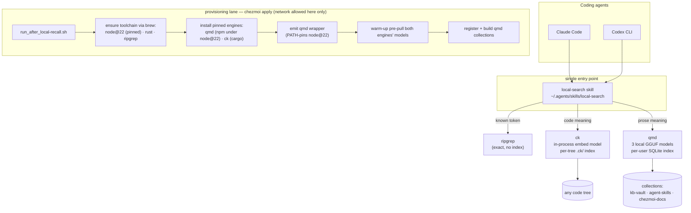

# 0001-local-recall-search — Design

## Architecture

Two lanes: the query lane (top) is what an agent touches per search — one skill routing to three local engines; the provisioning lane (bottom) runs at `chezmoi apply` and is the only moment networking is used.
Everything in the query lane operates offline (`Spec#C-1-zero-network-at-query-time`).

The skill reaches qmd through the D-8 wrapper, never a bare `qmd` on PATH — the arrow from the entry point to qmd is that wrapper.

## D-1: prose-recall-engine-qmd

Prose recall (`Spec#B-1-prose-recall-lookup`) is realized by qmd (`tobi/qmd`) pinned at `@tobilu/qmd@2.5.3`, installed by the pinned node's npm (D-5) and always invoked through the D-8 wrapper.
Rationale: [design-rationale.md](design-rationale.md#d-1-prose-recall-engine-qmd).

- Query command the skill teaches: `qmd query "<natural-language question>" -c <collection> --full-path` (hybrid keyword + vector + rerank — highest quality); `qmd search` (keyword) and `qmd vsearch` (vector-only) exist but are not routed to in v1.
- Result shape: `--full-path` is load-bearing and is the *only* flag that is — verified on a populated index, the engine emits the line number by default but renders the location as a `qmd://` docid, which no agent can open; the flag turns it into the on-disk `path:line` that `Spec#C-4-actionable-result-locations` requires (`Understanding#Delta-2-engine-surfaces-verified-against-installed-versions`).
- Models (all local GGUF, cached under `~/.cache/qmd/models/`): embeddinggemma-300M, qwen3-reranker-0.6b, query-expansion-1.7B — the engine exposes no pull command, so D-5 forces them by warm-up invocation and `Spec#B-4-first-query-readiness` holds.
- Index: `~/.cache/qmd/index.sqlite`; `--no-rerank` is the documented escape hatch if reranking proves slow on CPU.

## D-2: code-recall-engine-ck

Code recall (`Spec#B-2-code-recall-lookup`) is realized by ck (`BeaconBay/ck`) pinned at `ck-search@0.7.11` via cargo, landing a static binary at `~/.cargo/bin/ck`.
Rationale: [design-rationale.md](design-rationale.md#d-2-code-recall-engine-ck).

- Query command the skill teaches: `ck -n --hybrid "<behavior/concept phrase>" <path>` (BM25 + embedding); `--sem` for pure semantic when hybrid over-weights keywords.
  Both modes are verified present on the pinned version, and both auto-index on query.
- Result shape: `-n` is load-bearing, not cosmetic — without it the engine prints the file and the matching chunk but no line number, so only `-n` yields the span `Spec#C-4-actionable-result-locations` requires (`Understanding#Delta-2-engine-surfaces-verified-against-installed-versions`).
- Model cache: `~/.cache/ck`; the per-tree index is `.ck/` at the searched root (the directory D-7 keeps out of version control).
- No interpreter to pin: a self-contained Rust binary, so D-8's wrapper is not needed here — only `~/.cargo/bin` on PATH.
- Embeddings run in-process (ONNX, cached once); index lives in `.ck/` at the searched tree's root, built on first query and updated incrementally on later ones.
  The engine exposes no model-pull command, so D-5 forces its download by warm-up invocation.

## D-3: routing-skill-local-search

One shared skill, `local-search`, is the single entry point (`Spec#B-3-query-type-routing`): authored at `dot_agents/skills/local-search/SKILL.md`, exposed to Claude via `dot_claude/skills/symlink_local-search` (`../../.agents/skills/local-search`), read natively by Codex from `~/.agents/skills`.
Rationale: [design-rationale.md](design-rationale.md#d-3-routing-skill-local-search).

- Frontmatter `description` is a load-when trigger, not a superiority claim (draft, re-derived at implement):
  "Search local files by meaning when the exact words are unknown — code behavior/concepts, knowledge-base entries, skills, docs, notes.
  For a known token or regex, use rg directly; this skill owns the meaning-only case."
- Routing table the body teaches (positive instructions, each with its one-line why):
  - known token / regex → `rg` — exact, index-free, always fresh.
  - meaning over a code tree → `ck -n --hybrid "…" <path>` — embeddings find code whose names you don't know.
  - meaning over prose corpora → `qmd query "…" -c <collection> --full-path` — expansion + rerank absorb vocabulary drift.
- 4 few-shot examples in identical Do/Don't format covering the routing edges: known-symbol→rg, code-concept→ck, prose-concept→qmd, too-vague→sharpen the query first.
- Output contract: every routed command carries its location flags — `rg` natively, `ck` via `-n` (D-2), qmd via `--line-numbers --full-path` (D-1) — because each engine's *default* output omits the line span `Spec#C-4-actionable-result-locations` requires.
  Fallback only: if a qmd hit still lacks a usable anchor, resolve it with `rg -nF "<distinctive snippet fragment>" <file>`.
- Unindexed-corpus phrasing (`Spec#B-5-unindexed-corpus-surfaced`): the skill instructs the agent to relay the explicit state and remedy.
  For qmd, name the missing collection and the register+index command; for ck, state that the first query builds `.ck/` and will be slow, not broken.
- Deliberately absent: any network-escalation guidance (the predecessor's pathology) — nothing in the query lane may need it.

## D-4: interface-cli-only

Agents invoke the recall layer exclusively through the skill's CLI commands — no MCP server is registered for either engine (resolves `Deferrals#Defer-1-agent-interface-surface`).
Rationale: [design-rationale.md](design-rationale.md#d-4-interface-cli-only), including the recorded invalidation trigger for adding qmd's MCP later.

## D-5: provisioning-run-after-brew

A new `run_after_local-recall.sh` (pattern of `run_after_npx-skills.sh`: idempotent re-run every apply, internal checks) provisions everything at `chezmoi apply`, realizing `Spec#B-4-first-query-readiness` and `Spec#C-3-uniform-across-machines`.
Rationale: [design-rationale.md](design-rationale.md#d-5-provisioning-run-after-brew).

- Toolchain: missing pieces are installed via Homebrew — `node@22` (the pinned qmd interpreter), `rust` (provides cargo for ck), `ripgrep`; if `brew` itself is absent the script fails loudly naming the remedy (never a silent skip).
  bun is not part of the toolchain: qmd's launcher only falls back to bun when no node exists at all, so it could never have been the runtime (`Understanding#Delta-1-qmd-runtime-is-path-dependent-not-bun`).
- Engines version-pinned for cross-machine uniformity: qmd `@tobilu/qmd@2.5.3` installed by **node@22's own npm into D-8's private prefix** (never the default global one, which lands on PATH), and `cargo install ck-search --version 0.7.11` — pins bumped deliberately, in this repo.
  Installing qmd under the pinned node is load-bearing, not incidental: its native SQLite dependency is ABI-locked to the installing node, so the installing and invoking node must be the same one D-8 pins.
- Competing engine copies are removed, not tolerated: any qmd previously installed onto PATH by another package manager is uninstalled, since a leftover copy reintroduces the PATH-order race D-8 exists to eliminate (`Understanding#Delta-1-qmd-runtime-is-path-dependent-not-bun`).
- Model pre-pull: neither engine exposes a pull command, so the script forces each engine's model download with a **warm-up invocation** against a throwaway corpus at provision time; the query lane never downloads.
- Collections: registers and builds the three qmd collections of D-6.
- Idempotence: `command -v` + version + wrapper + model-cache + collection checks make every step a no-op when already satisfied.
  Checks read exit codes, not output: qmd prints fatal errors that a naive pipeline would mask (`Understanding#Delta-1-qmd-runtime-is-path-dependent-not-bun`).

## D-8: qmd-vendored-runtime-boundary

qmd is vendored: the engine installs into a **private prefix that is never on PATH**, and the sole `qmd` on PATH is a generated wrapper that pins the interpreter before exec'ing it — so qmd's declared node floor becomes a private dependency of qmd rather than a standing requirement on the machine's own node, realizing `Spec#C-3-uniform-across-machines` for the prose lane.
Rationale: [design-rationale.md](design-rationale.md#d-8-qmd-vendored-runtime-boundary).

- Wrapper shape: `PATH="<pinned-node-bin>:$PATH" exec "<private-prefix>/bin/qmd" "$@"`.
  Setting PATH is the mechanism, not a convenience: qmd's launcher re-execs `node` resolved from PATH, so an absolute node path does **not** pin it (`Understanding#Delta-1-qmd-runtime-is-path-dependent-not-bun`).
- The private prefix is load-bearing, and is what makes the wrapper's name unambiguous rather than a race: a default global install puts the engine's own bin in a directory that is already on PATH, so a same-named wrapper would merely compete with it and win or lose by PATH order — machine-varying, which is the very property `Spec#C-3-uniform-across-machines` forbids.
  With the engine's bin off PATH, the wrapper has no competitor and shadows nothing.
- Provisioning consequence (D-5): the engine is installed with an explicit private prefix, and any engine copy previously installed onto PATH by another package manager is removed — a leftover competitor reintroduces the same race.
- Ambient state is untouched: the machine's own node and version manager keep working, and nothing but qmd sees the pinned node.
- Invalidation: if qmd ships a launcher honoring an explicit interpreter, or drops the ABI-locked native dependency, the wrapper collapses to a plain path entry — the vendoring boundary can stay either way.

## D-6: index-lifecycle-refresh-on-invoke

Index freshness is achieved by refreshing incrementally at query time, not by a resident watcher: each skill-guided qmd invocation runs incremental index update before querying, and ck updates its `.ck/` incrementally per query — together realizing `Spec#C-2-staleness-surfaced` on the fresh branch.
Rationale: [design-rationale.md](design-rationale.md#d-6-index-lifecycle-refresh-on-invoke).

- qmd collections (name → root): `kb-vault` → `~/.local/share/metacognition-vault`; `agent-skills` → `~/.agents/skills`; `chezmoi-docs` → `~/.local/share/chezmoi/docs`.
  `~/.claude/skills` is deliberately excluded in v1 — it is mostly symlinks into `agent-skills` and would double-index; revisit when dedup behavior is verified.
- Fallback branch: if incremental update proves slow on a corpus, the skill prefixes results with an explicit staleness indication instead (the `Spec#C-2-staleness-surfaced` or-branch) — never a silent stale result.

## D-7: ck-index-git-ignore

`.ck/` index directories are kept out of every repo's version control via the chezmoi-managed global git ignore: `dot_config/git/ignore` gains a `.ck/` line (git's default excludes path when `core.excludesFile` is unset).
Why: per-tree indexes must never leak into commits, and one managed global line beats per-repo `.gitignore` edits; if the live gitconfig overrides `core.excludesFile`, implement lands the line in that file instead.
