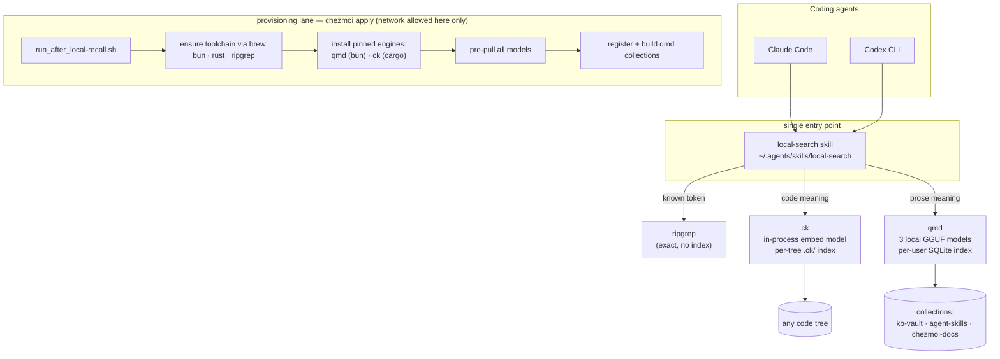

# 0001-local-recall-search — Design

## Architecture

Two lanes: the query lane (top) is what an agent touches per search — one skill routing to three local engines; the provisioning lane (bottom) runs at `chezmoi apply` and is the only moment networking is used.
Everything in the query lane operates offline (`Spec#C-1-zero-network-at-query-time`).

## D-1: prose-recall-engine-qmd

Prose recall (`Spec#B-1-prose-recall-lookup`) is realized by qmd (`tobi/qmd`), installed as `@tobilu/qmd` via bun.
Rationale: [design-rationale.md](design-rationale.md#d-1-prose-recall-engine-qmd).

- Query command the skill teaches: `qmd query "<natural-language question>" -c <collection>` (hybrid keyword + vector + rerank — highest quality); `qmd search` (keyword) and `qmd vsearch` (vector-only) exist but are not routed to in v1.
- Result shape: file path + matching snippet; when a line anchor is needed the skill hops via exact match (see D-3 output contract, satisfying `Spec#C-4-actionable-result-locations`).
- Models (all local GGUF, cached under `~/.cache/qmd/models/`): embeddinggemma-300M, qwen3-reranker-0.6b, query-expansion-1.7B — pre-pulled by D-5 so `Spec#B-4-first-query-readiness` holds.

## D-2: code-recall-engine-ck

Code recall (`Spec#B-2-code-recall-lookup`) is realized by ck (`BeaconBay/ck`), installed as `ck-search` via cargo.
Rationale: [design-rationale.md](design-rationale.md#d-2-code-recall-engine-ck).

- Query command the skill teaches: `ck --hybrid "<behavior/concept phrase>" <path>` (BM25 + embedding); `--sem` for pure semantic when hybrid over-weights keywords.
- Result shape: grep-style `file:line` spans — natively satisfies `Spec#C-4-actionable-result-locations`.
- Embeddings run in-process (ONNX, BGE-small ~130 MB, cached once); index lives in `.ck/` at the searched tree's root, built on first query and updated incrementally on later ones.

## D-3: routing-skill-local-search

One shared skill, `local-search`, is the single entry point (`Spec#B-3-query-type-routing`): authored at `dot_agents/skills/local-search/SKILL.md`, exposed to Claude via `dot_claude/skills/symlink_local-search` (`../../.agents/skills/local-search`), read natively by Codex from `~/.agents/skills`.
Rationale: [design-rationale.md](design-rationale.md#d-3-routing-skill-local-search).

- Frontmatter `description` is a load-when trigger, not a superiority claim (draft, re-derived at implement):
  "Search local files by meaning when the exact words are unknown — code behavior/concepts, knowledge-base entries, skills, docs, notes.
  For a known token or regex, use rg directly; this skill owns the meaning-only case."
- Routing table the body teaches (positive instructions, each with its one-line why):
  - known token / regex → `rg` — exact, index-free, always fresh.
  - meaning over a code tree → `ck --hybrid "…" <path>` — embeddings find code whose names you don't know.
  - meaning over prose corpora → `qmd query "…" -c <collection>` — expansion + rerank absorb vocabulary drift.
- 4 few-shot examples in identical Do/Don't format covering the routing edges: known-symbol→rg, code-concept→ck, prose-concept→qmd, too-vague→sharpen the query first.
- Output contract: `rg`/`ck` results pass through as `file:line`; a qmd result needing a line anchor is resolved by `rg -nF "<distinctive snippet fragment>" <file>` (`Spec#C-4-actionable-result-locations`).
- Unindexed-corpus phrasing (`Spec#B-5-unindexed-corpus-surfaced`): the skill instructs the agent to relay the explicit state and remedy.
  For qmd, name the missing collection and the register+index command; for ck, state that the first query builds `.ck/` and will be slow, not broken.
- Deliberately absent: any network-escalation guidance (the predecessor's pathology) — nothing in the query lane may need it.

## D-4: interface-cli-only

Agents invoke the recall layer exclusively through the skill's CLI commands — no MCP server is registered for either engine (resolves `Deferrals#Defer-1-agent-interface-surface`).
Rationale: [design-rationale.md](design-rationale.md#d-4-interface-cli-only), including the recorded invalidation trigger for adding qmd's MCP later.

## D-5: provisioning-run-after-brew

A new `run_after_local-recall.sh` (pattern of `run_after_npx-skills.sh`: idempotent re-run every apply, internal checks) provisions everything at `chezmoi apply`, realizing `Spec#B-4-first-query-readiness` and `Spec#C-3-uniform-across-machines`.
Rationale: [design-rationale.md](design-rationale.md#d-5-provisioning-run-after-brew).

- Toolchain: missing runtimes are installed via Homebrew — `bun` (runs qmd), `rust` (provides cargo for ck), `ripgrep`; if `brew` itself is absent the script fails loudly naming the remedy (never a silent skip).
- Engines version-pinned for cross-machine uniformity: `bun install -g @tobilu/qmd@<pinned>` and `cargo install ck-search --version <pinned>` — pins bumped deliberately, in this repo.
- Model pre-pull: after install, the script forces both engines' model downloads at provision time (a warm-up invocation or the engine's pull command, whichever the installed version offers — verified at implement); the query lane never downloads.
- Collections: registers and builds the three qmd collections of D-6.
- Idempotence: `command -v` + version + model-cache + collection checks make every step a no-op when already satisfied.

## D-6: index-lifecycle-refresh-on-invoke

Index freshness is achieved by refreshing incrementally at query time, not by a resident watcher: each skill-guided qmd invocation runs incremental index update before querying, and ck updates its `.ck/` incrementally per query — together realizing `Spec#C-2-staleness-surfaced` on the fresh branch.
Rationale: [design-rationale.md](design-rationale.md#d-6-index-lifecycle-refresh-on-invoke).

- qmd collections (name → root): `kb-vault` → `~/.local/share/metacognition-vault`; `agent-skills` → `~/.agents/skills`; `chezmoi-docs` → `~/.local/share/chezmoi/docs`.
  `~/.claude/skills` is deliberately excluded in v1 — it is mostly symlinks into `agent-skills` and would double-index; revisit when dedup behavior is verified.
- Fallback branch: if incremental update proves slow on a corpus, the skill prefixes results with an explicit staleness indication instead (the `Spec#C-2-staleness-surfaced` or-branch) — never a silent stale result.

## D-7: ck-index-git-ignore

`.ck/` index directories are kept out of every repo's version control via the chezmoi-managed global git ignore: `dot_config/git/ignore` gains a `.ck/` line (git's default excludes path when `core.excludesFile` is unset).
Why: per-tree indexes must never leak into commits, and one managed global line beats per-repo `.gitignore` edits; if the live gitconfig overrides `core.excludesFile`, implement lands the line in that file instead.
