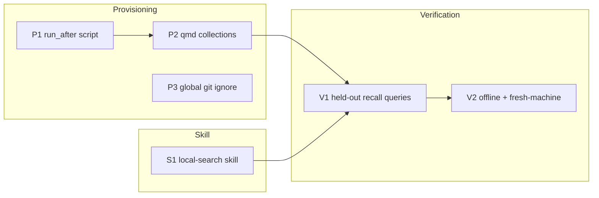

# 0001-local-recall-search — Tasks

## Guidelines

- Work in the chezmoi source repo on a feature branch off the repo default branch; never hand-edit applied targets — change source, verify via `chezmoi diff` / `chezmoi apply`.
- Engine CLI surfaces in Design (subcommands, flags, pull commands) are research-derived drafts: verify each against the installed pinned version at task entry; a behavioral mismatch with a Design assumption is a stop-the-line trigger, not something to silently adapt around.

## Dependency DAG

Tracks: P = provisioning lane (script, corpora, git hygiene), S = the routing skill, V = end-to-end verification.
P and S start independently; V consumes both.

## T: P1

- **Goal**: Provision the full query lane at `chezmoi apply` — toolchain via brew, pinned engines vendored per `Design#D-8-qmd-vendored-runtime-boundary`, models pre-pulled — per `Design#D-5-provisioning-run-after-brew`, so `Spec#B-4-first-query-readiness` becomes achievable and re-running every apply is the ongoing uniformity mechanism for `Spec#C-3-uniform-across-machines`.
- **Repo**: chezmoi source (`run_after_local-recall.sh`)
- **Completion**:
  - (a) `chezmoi apply` runs the script cleanly; an immediate second apply is a full no-op (idempotence).
  - (b) `qmd` and `ck` resolve at the pinned versions; `rg` present — the pin + re-run-every-apply pair is the standing `Spec#C-3-uniform-across-machines` mechanism.
  - (c) both engines' model caches are populated by the script itself (no first-query download remains).
  - (d) with brew removed from `PATH` in a test shell, the script fails loudly naming the remedy — no silent skip.
  - (e) runtime pinning holds where it previously failed (`Design#D-8-qmd-vendored-runtime-boundary`, `Spec#C-3-uniform-across-machines`): a qmd index operation exits 0 from a shell whose ambient `node` is the machine's own version-managed one, and exits 0 again with that node removed from `PATH` entirely — verified by exit code, never by output text.
  - (f) the vendoring boundary holds (`Design#D-8-qmd-vendored-runtime-boundary`): exactly one qmd resolves on PATH and it is the wrapper — no competing copy from any other package manager survives, and the engine's own bin resolves nowhere on PATH.
- **Dependencies**: none
- **Guidelines**: The engines' installed `--help` is authoritative over the Design's command text; a divergence found here is `Understanding#Delta-2-engine-surfaces-verified-against-installed-versions` repeating, so raise it rather than adapting the script around it.

## T: P2

- **Goal**: Register and build the three qmd collections (`Design#D-6-index-lifecycle-refresh-on-invoke`) so prose corpora are queryable and index freshness holds at query time (`Spec#C-2-staleness-surfaced`).
- **Repo**: chezmoi source (extends `run_after_local-recall.sh`)
- **Completion**:
  - (a) qmd lists exactly `kb-vault`, `agent-skills`, `chezmoi-docs`; a query over each returns results.
  - (b) freshness: add a marker line to a vault file, run the skill's refresh-then-query sequence, the marker is findable (`Spec#C-2-staleness-surfaced` fresh branch).
  - (c) a query naming an unregistered collection/path yields an explicit not-indexed response with the register+index remedy (`Spec#B-5-unindexed-corpus-surfaced`, qmd side).
- **Dependencies**: P1 lands the engines that make registration runnable.

## T: P3

- **Goal**: Keep `.ck/` index directories out of all repos via the managed global git ignore (`Design#D-7-ck-index-git-ignore`).
- **Repo**: chezmoi source (`dot_config/git/ignore`)
- **Completion**:
  - (a) in a scratch repo containing `.ck/`, `git check-ignore -v .ck/` matches the managed global ignore.
  - (b) if the live gitconfig sets `core.excludesFile`, the line lands in that file instead and (a) still passes.
- **Dependencies**: none

## T: S1

- **Goal**: Author the `local-search` routing skill and its Claude symlink per `Design#D-3-routing-skill-local-search`, making it the single entry point that steers by query type (`Spec#B-3-query-type-routing`) and carries the unindexed/slow-first-query phrasing (`Spec#B-5-unindexed-corpus-surfaced`, ck side).
- **Repo**: chezmoi source (`dot_agents/skills/local-search/`, `dot_claude/skills/symlink_local-search`)
- **Completion**:
  - (a) after apply, `~/.agents/skills/local-search/SKILL.md` exists and `~/.claude/skills/local-search` resolves to it; both agents list the skill.
  - (b) content check against D-3: load-when description, positive routing table with reasons, 4 identically-formatted Do/Don't examples, the qmd location flags carried on every routed qmd command (`Spec#C-4-actionable-result-locations`), unindexed phrasing, zero network-escalation text.
  - (c) routing behavior: a known-token prompt leads the agent to `rg`; a meaning-only prompt leads it to the matching engine (`Spec#B-3-query-type-routing`, one-shot per branch).
- **Dependencies**: P1 lands the engines that make (c) executable end-to-end; (a)–(b) need nothing.

## T: V1

- **Goal**: Prove the recall contract with held-out queries — the Requirements success signal — over both prose and code lanes (`Spec#B-1-prose-recall-lookup`, `Spec#B-2-code-recall-lookup`) with actionable locations (`Spec#C-4-actionable-result-locations`).
- **Repo**: chezmoi source (`docs/features/0001-local-recall-search/`, verification notes)
- **Completion**:
  - (a) ≥5 held-out natural-language queries over the three collections, each with zero keyword overlap with its target, return the right target (`Spec#B-1-prose-recall-lookup`).
  - (b) ≥2 behavior-described queries over a code tree not previously indexed return the realizing locations as `file:line` (`Spec#B-2-code-recall-lookup`, `Spec#C-4-actionable-result-locations`); first-query index build observed and non-broken (`Spec#B-5-unindexed-corpus-surfaced`, ck side).
  - (c) a qmd result is resolved to a line anchor via the snippet hop (`Spec#C-4-actionable-result-locations`, prose side).
- **Dependencies**: P2 and S1 land the corpora and the routing that V1 exercises.

## T: V2

- **Goal**: Prove the two properties the predecessor failed — no network in the query lane (`Spec#C-1-zero-network-at-query-time`) and first-query readiness on a fresh machine (`Spec#B-4-first-query-readiness`).
- **Repo**: chezmoi source (verification notes)
- **Completion**:
  - (a) with networking disabled, every V1 query class (prose, code, routing, refresh-then-query) reproduces its results (`Spec#C-1-zero-network-at-query-time`).
  - (b) fresh-machine simulation: provision into a clean temporary `HOME` (or the next real machine), then the very first recall query succeeds offline (`Spec#B-4-first-query-readiness`); behavior matches this machine (`Spec#C-3-uniform-across-machines`).
- **Dependencies**: V1 establishes the query set and expected results that (a)–(b) replay.
