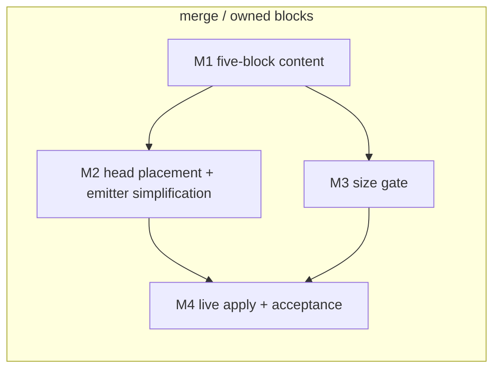

# 0002-agents-md-layering-contract — Tasks

## Guidelines

- Work on a feature branch off `main`; the live `~/AGENTS.md` changes only through the dotfiles source + apply, never by hand-editing.
- `modify_AGENTS.md` stays a stdlib-only python3 script in its existing idiom (regex block parser, `SystemExit` on violation, stdin → stdout).
- Verify merge behavior by piping fixture input to the script directly; do not run a real apply against `$HOME` before M4.
- **GAP** — `Spec#B-3-retired-blocks-leave-the-file` and `Spec#C-4-hard-lines-terminal` are retired items (`Understanding#Delta-2-retired-tags-need-no-registry`, `Understanding#Delta-3-recency-misattributed-to-file-tail`); no live task covers them by design.

## Dependency DAG

Single track: everything lands in one repo and one deployment (one apply); M2 and M3 are parallel after M1.

## T: M1

- **Goal**: Collapse the owned source to the five consolidated blocks per `Design#D-1-five-block-owned-set` — author the block texts within their per-block envelopes, update the owned set and order accordingly, so an apply renders exactly the defined blocks (`Spec#B-2-apply-renders-owned-set`).
- **Repo**: `~/.local/share/chezmoi` (`modify_AGENTS.md` embedded source)
- **Completion**:
  - (a) combined owned source, tag lines included, ≤ 2,000 chars (`Spec#C-1-owned-size-budget`), each block within its D-1 envelope;
  - (b) single prose home verified for the formerly duplicated rules — ask-before-acting, primary-sources, working-set discipline, branch-base definition each match exactly one block (`Spec#C-2-single-prose-home`);
  - (c) piping the current live file into the script yields output whose owned half is exactly the five blocks in defined order (`Spec#B-2-apply-renders-owned-set`).
- **Dependencies**: none

## T: M2

- **Goal**: Make head placement structural in the merge per `Design#D-5-head-lead-emitter` (`Spec#C-5-hard-lines-lead`) and strip the superseded machinery — no `RETIRED` set, no `TERMINAL` constant, a plain forward emitter — without disturbing foreign spans (`Spec#C-3-foreign-span-pass-through`).
  (Revised per `Understanding#Delta-2-retired-tags-need-no-registry` and `Understanding#Delta-3-recency-misattributed-to-file-tail`.)
- **Repo**: `~/.local/share/chezmoi` (`modify_AGENTS.md` merge logic)
- **Completion**:
  - (a) fixture live file (post-deletion shape: five owned + four upstream anchors) → output opens with `operating_frame` then `change_discipline` (`Spec#C-5-hard-lines-lead`);
  - (b) fixture with an unknown tag (e.g. a future checkpoint block) → its span appends after all `ORDER` blocks; the head is unchanged (`Spec#C-5-hard-lines-lead`);
  - (c) all never-owned spans (the four upstream anchors, the unknown tag, untagged extras) byte-identical between fixture and output (`Spec#C-3-foreign-span-pass-through`);
  - (d) the script carries no `RETIRED` or `TERMINAL` names and no retired-tag or held-back-terminal branch.
- **Dependencies**: M1 lands the shrunken owned set the reshaped `ORDER` emits.

## T: M3

- **Goal**: Enforce the budget at apply time per `Design#D-2-apply-time-size-gate`, so an over-budget owned source fails the apply with the measured size and the budget named (`Spec#B-1-over-budget-apply-fails`, standing ceiling `Spec#C-1-owned-size-budget`).
- **Repo**: `~/.local/share/chezmoi` (`modify_AGENTS.md` validation path)
- **Completion**:
  - (a) source inflated past 2,000 chars → script exits non-zero, stdout empty (no partial write), stderr names measured chars and the 2,000 budget (`Spec#B-1-over-budget-apply-fails`);
  - (b) unmodified (within-budget) source → exit 0, normal render.
- **Dependencies**: M1 lands the within-budget content that makes the gate's green path real.

## T: M4

- **Goal**: Adopt on the live machine and accept the round — a real apply regenerates `~/AGENTS.md` under the new contract, proving the Requirements success signal (footprint halved, one home per invariant, breach rejected).
- **Repo**: `~/.local/share/chezmoi` → live `$HOME`
- **Completion**:
  - (a) **first, on each machine**: one-time manual deletion of the four retired spans (`context_discipline`, `ko_output_quality`, `plan_style`, `research_before_planning`) from the live `~/AGENTS.md`, before or with that machine's first apply of the registry-free script — applied first, the stale spans survive as unknown tags with a clean `chezmoi diff` (`Understanding#Delta-2-retired-tags-need-no-registry`);
  - (b) real apply succeeds; live file's owned half is the five blocks, opening `operating_frame` then `change_discipline` (`Spec#B-2-apply-renders-owned-set`, `Spec#C-5-hard-lines-lead`);
  - (c) diff against the pre-apply file shows upstream anchor spans byte-identical (`Spec#C-3-foreign-span-pass-through`) and the four retired spans absent;
  - (d) empty-stdin (bootstrap) run renders all five blocks (`Spec#B-2-apply-renders-owned-set`);
  - (e) deliberate over-budget edit on a scratch copy fails the apply (`Spec#B-1-over-budget-apply-fails`);
  - (f) `~/.claude/CLAUDE.md` and `~/.codex/AGENTS.md` symlinks still resolve to the regenerated file.
- **Dependencies**: M2 and M3 land the mechanisms this acceptance run exercises.
