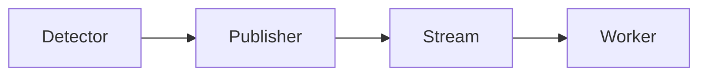

# LP-1 - DESIGN

## Architecture

## Decision-1: async-publisher
Use an asynchronous publisher so anomaly reporting does not block the mission path. Rationale: `design-rationale.md#Decision-1-async-publisher`.
