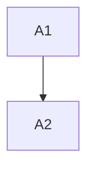

# LeanPlan Plan Stage

Edge: DESIGN to TASK (`plan.md`).

## Inputs

- REQUIREMENT, SPEC, DESIGN
- DESIGN RATIONALE only for challenged or non-obvious decisions
- Current repo boundaries and deployment constraints

## Output

`docs/features/<KEY>/plan.md`

## Procedure

1. Load artifact contract and surface artifacts.
2. Split work into landable tasks.
3. Draw dependency DAG with Mermaid.
4. Write task cards with intent, repo, completion criteria, dependencies, and optional guidelines.
5. Cite the SPEC AC/INV or DESIGN decision that justifies each task.
6. Verify bidirectional traceability before close-out.

## Guardrails

- TASK is navigation, not a script.
- Do not include line-level edit instructions.
- Dependencies are enablers. The implementation agent re-evaluates them at task entry.
- Completion criteria state observable verification and method when non-obvious.
- If the DAG exceeds one deployment, stop and split the feature.

## Template

````markdown
# <KEY> - TASK

## Guidelines
- <only feature-level work stance rules>

## Dependency DAG



## Task: A1

**Goal**: <what to accomplish, citing SPEC#AC-* or DESIGN#Decision-*>

**Repo**: <repo/path>

**Completion criteria**:
- <observable proof, citing SPEC#AC-* or SPEC#INV-*>

**Dependencies**: none

**Guidelines**: <only task-local stance rules when needed>
````
