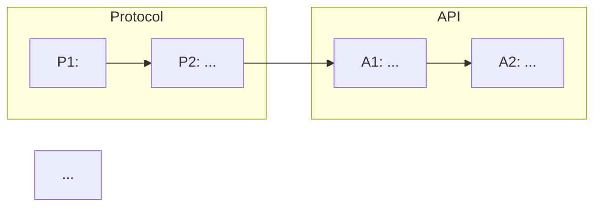

# plan

LeanPlan skill. Edge: **DESIGN → TASK**. Produces the execution navigation graph for landing the feature — not an execution script. The impl agent re-reasons at each task entry.

## Context

LeanPlan stages: REQUIREMENT → SPEC → DESIGN → TASK → code. TASK is the **execution navigation**: a DAG of land-able work items plus per-task cards. Each card is intent + constraints, never step-by-step edit instructions — the implementer re-derives against current code at task entry. Dependencies are *enablers* (what becomes possible when the prior lands), not rigid gates. Primary reader is the downstream `impl` agent; engineering reviewers check scope + sequencing.

## Inputs

- `$ARGUMENTS` — `<feature-key>` (required).
- `<cwd>/docs/features/<KEY>/spec.md` (required). If absent, stop and point the user at `/specify`.
- `<cwd>/docs/features/<KEY>/design.md` (required). If absent, stop and point at `/design`.
- `<cwd>/docs/features/<KEY>/design-rationale.md` — *not* loaded by default. Load only when a decision seems questionable during planning and you need full rationale.

## Output

- `<cwd>/docs/features/<KEY>/task.md`.

## Artifact shape

```
# <KEY> — TASK

## Guidelines   (conditional — include only when feature-wide work-stance rules genuinely apply)
- <feature-wide git / PR / rollout / coordination rule>
- ...

## DAG



<caption: what the tracks represent; 1-2 sentences.>

## Task: P1

- **Goal**: <WHAT + HOW when non-obvious. Inline anchors colocated with the sentence they support, e.g. "Add anomaly publisher per SPEC#O-1-detected-anomaly-published-within-5s, realized via outbox pattern per DESIGN#Decision-3-outbox-based-publisher." Anchors carry ID + slug so the slug names the reference at-a-glance; agent JIT-loads full content when needed.>
- **Repo**: <path or repo name>
- **Completion**: <observable verification + method inline when non-obvious. Episodic Outcomes → one-shot test. Continuous Invariants → ongoing mechanism (SLO / monitor / CI gate). Split dev / prod for infra + DB.>
- **Dependencies**: <prior task IDs as enablers, e.g. "P2 lands the schema that makes P1 testable"; truly-external notes only when needed>
- **Guidelines**   (conditional): <task-scoped work-stance rule — scope discipline, reuse discipline, procedural constraint>

## Task: A1
...
```

- Anchor pattern: `## Task: <id>` where `<id>` is track-prefix + integer (e.g. `P1`, `A1`, `D1`, `I1`). Track prefixes are chosen per feature (common: `P`=protocol, `A`=api, `D`=data, `I`=infra). Tracks exist for human navigation and coordination; the impl agent doesn't consume them as a formal concept.
- Task cards must be **self-sufficient at cut-off boundary**: if an anchor target happens to be truncated when the agent loads the card, the sentence still reads as a complete thought (slug names the reference in line).
- Inline anchors format: `SPEC#O-<N>-<slug>`, `SPEC#INV-<N>-<slug>`, `DESIGN#Decision-<N>-<slug>`, doc-Guideline reference.

## Guardrails

- **Intent + constraints, never scripts.** No step-by-step edit instructions ("edit file X at line Y"). The impl agent re-derives against current code at task entry — the task card would rot against live reality otherwise.
- **Dependencies are *enablers*, not gates.** Phrase as "P2 lands the schema that makes P1 testable", not "P1 cannot start until P2 completes". Impl agent re-evaluates at task entry.
- **Guidelines describe work-stance, not system shape.** Guidelines = how the work *proceeds* (git flow, scope discipline, rollout sequence, temporary coordination). If the line describes what exists *after* the work lands, push it to DESIGN. If it's an externally-observable compat behavior, push to SPEC Invariants. If it's a test specification, push to a task's Completion criterion.
- **External blockers become first-class tasks.** If the work requires filing INFRAREQ, DBREQ, or coordinating with another team, that filing *is* a task in the DAG, not a hidden "waiting" state. Only truly-out-of-control external blockers remain as dependency notes.
- **Anchors carry ID + slug (identity, not restatement).** `SPEC#O-1-detected-anomaly-published-within-5s` — ID stable across slug edits, slug names the reference at-a-glance. Do not paraphrase the item's content in the task card; rely on the anchor + JIT load when needed.
- **Conditional sections must earn their place.** Doc-level Guidelines only when feature-wide stance rules genuinely apply. Task-level Guidelines only when the task needs procedural framing beyond Goal + Completion.

## Procedure

1. **Load SPEC + DESIGN** for `<KEY>`. Don't eagerly load RATIONALE — only if a decision seems questionable mid-planning.
2. **Compose doc-level Guidelines (conditional)** — feature-wide work-stance rules only: base branch, canary sequence, cross-team coordination. Skip otherwise.
3. **Identify tracks** — group work by a coordination-relevant axis (common: repo, or protocol-vs-service, or infra-vs-app). Each track = a Mermaid subgraph + a prefix letter.
4. **Author `## Task: <id>` cards**, each with:
   - **Goal** — WHAT + HOW (when non-obvious), inline `SPEC#…` / `DESIGN#…` anchors colocated with the supported sentence.
   - **Repo** — where the work lives.
   - **Completion** — observable verification + method when non-obvious. Split dev / prod for infra + DB. Continuous Invariants → monitor / SLO / CI gate; episodic Outcome items → one-shot test.
   - **Dependencies** — prior task IDs as enablers.
   - **Guidelines** (conditional) — task-scoped stance rules.
5. **Draw the DAG** at the top. Subgraphs by track; edges = "prior unblocks this one".
6. **Bidirectional verification** — do this explicitly and report. Do not paper over gaps:
   - **Forward**: walk every SPEC `### O-<N>` and `### INV-<N>`; each must map to ≥ 1 task Completion criterion. List uncovered items.
   - **Reverse**: walk every `## Task: <id>`; each Goal must cite ≥ 1 SPEC O / INV / DESIGN Decision / doc Guideline as its reason. List orphan tasks.
7. **Self-check**:
   - No step-by-step edit instructions in any Goal.
   - Every Completion is observable (you could write the verification).
   - Task cards are self-sufficient at cut-off (sentences complete without the anchor target).
   - DAG renders (paste into a Mermaid preview if uncertain).

## Completion

- `task.md` contains doc-level Guidelines (if applicable), Mermaid DAG with subgraphs + prefixed IDs, and `## Task: <id>` cards with all required fields.
- Bidirectional mapping report emitted (both directions cleared or gaps surfaced + resolved).
- Tell the user: for each independently startable task, `/impl <KEY> <task-id>`.
