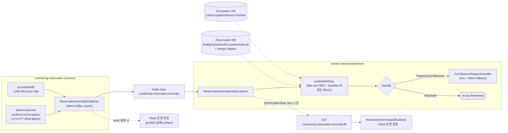

# NEWCS-3526 — 예약 이상 탐지 v1 · 설계

> 본 문서는 v1 **최종 설계 결정** 만 담는다. 각 결정의 근거·대안·트레이드오프는 `./design-rationale.md` 에 분리. 일반 Kafka 개념 지식 백업은 `./research.md` §8.

---

## 1. 아키텍처 개요



탐지 지점은 Kafka 에 direct async publish (mission 경로 건드리지 않음). 전송 실패는 Slack 으로 surface. 소비자(worker) 는 **현재 DB 상태를 재조회해** 분류 후 대차 Jira 로 귀결.

---

## 2. 스코프 (v1)

| 항목 | 값 |
|---|---|
| 탐지 지점 | 2 곳만 |
| 이상 클래스 | 2 가지 (`Resolved`, `RequiresCarTakeover`) |
| 판정 주체 | 소비자 — 이벤트는 단순 trigger, 실제 판정은 소비 시점에 재수행 |
| 판정 조건 | 예약의 서비스 구간(`interval`)에 **배타적 차량 점유가 보장되지 않는다** |
| 판정 데이터 소스 | 예약 테이블 + 점유 테이블 모두 |
| idle-zero 재평가 | 즉시 probe → 여전히 이상이면 소폭 backoff 재시도 (confirm deadline 미경과 + idle-zero 대상일 때만) |
| Dedup | 전체 파이프라인엔 없음 (handler-level `FORCE_EXTEND_JIRA_MEMO_PREFIX` 체크로 충분) |
| Metrics / 대시보드 | v1 범위 제외 |
| Canary | 없음 |
| Consumer 호스팅 | `bootstrap/worker` 서브프로젝트 |

### 두 탐지 지점

1. **`IdleZeroService.confirmCarOccupation` 최종 실패 처리**
   - `services/carsharing-reservation/subprojects/reservation/core/src/main/kotlin/kr/socar/carsharing/reservation/domain/service/IdleZeroService.kt:274-277`
   - `handleCarOccupationConfirmFailures(failures, currOccupation)` 호출 시점.

2. **점유 → 예약 정합성 sync 실패**
   - `services/carsharing-reservation/subprojects/reservation/core/src/main/kotlin/kr/socar/carsharing/reservation/domain/service/ReservationCarOccupationEventHandlingService.kt:196-205`
   - `reconcileWith` 내 `ConflictingReservationPreExistingException` catch 지점.

---

## 3. Kafka 토픽

이 섹션은 **토픽이 어떤 물리 설정을 가져야 하는가** 만 다룬다. 프로비저닝 절차는 `plan.md` I1.

### 3.1 토픽 목록

| 토픽 | 역할 |
|---|---|
| `carsharing.reservation.anomaly` | 원본 (publisher → consumer) |
| `carsharing.reservation.anomaly.dlt` | Dead-letter (예외 발생 시 즉시 전송) |

Retry 토픽은 만들지 않는다 — `@RetryableTopic(attempts = "1")`. 근거: `design-rationale.md` §13.

### 3.2 원본 토픽 설정 (`carsharing.reservation.anomaly`)

| 파라미터 | 값 |
|---|---|
| `partitions` | **3** |
| `replication.factor` | **3** |
| `min.insync.replicas` | **2** |
| `cleanup.policy` | **`delete`** |
| `retention.ms` | **259200000 (3d)** |
| `segment.ms` | **86400000 (1d)** |
| `segment.bytes` | default (1GB) |
| `max.message.bytes` | default (~1MB) |
| `compression.type` | default (`producer`) |
| `unclean.leader.election.enable` | default (`false`) |
| `message.timestamp.type` | default (`CreateTime`) |

근거: `design-rationale.md` §2 (partitions), §3 (RF/ISR/acks triangle), §4 (retention), §5 (segment.ms gotcha), §6 (cleanup.policy).

**관련 producer-side 설정** (§5.2 참고):
- `acks=all`, `enable.idempotence=true` — `min.insync.replicas=2` 와 쌍. 근거 `design-rationale.md` §3, §7.

### 3.3 DLT 토픽 설정 (`carsharing.reservation.anomaly.dlt`)

| 파라미터 | 값 |
|---|---|
| `partitions` | **1** |
| `replication.factor` | **3** |
| `min.insync.replicas` | **2** |
| `cleanup.policy` | **`delete`** |
| `retention.ms` | **1209600000 (14d)** |
| `segment.ms` | **86400000 (1d)** |
| 그 외 | default |

근거: `design-rationale.md` §8 (retention), §9 (RF 이탈).

### 3.4 네이밍·키·serde

- **Naming convention**: `{group}.{domain}.{purpose}`. 모든 Kafka 메시지는 이벤트이므로 `-event` 접미사 생략.
- **Key**: `reservation_id` (String). 근거: `design-rationale.md` §1 (동시 처리 직렬화).
- **Value**: protobuf binary, Schema Registry serde (§5.1). Subject = proto FQN (`RecordNameStrategy`).

### 3.5 IAM ARN (worker 접근 권한)

`services/carsharing-reservation/deploy/terraform/{env}.ap-northeast-2/carsharing_reservation_worker/app.tf` 의 `msk_data_access_resources` 에 추가:

```hcl
"arn:aws:kafka:ap-northeast-2:<acct>:topic/<cluster>/<cluster-id>/carsharing.reservation.anomaly",
"arn:aws:kafka:ap-northeast-2:<acct>:topic/<cluster>/<cluster-id>/carsharing.reservation.anomaly.dlt",
```

### 3.6 Schema Registry

- Registry: AWS Glue (`{env}-msk-schema-registry`).
- Subject: proto FQN `socar.carsharing.reservation.event.v1.ReservationAnomalyDetected` (`RecordNameStrategy`).
- 등록: Publisher 의 `auto.register.schemas=true` 로 첫 publish 시 자동.

### 3.7 간과하기 쉬운 gotcha

1. **`segment.ms` < `retention.ms` 필수** — 기본값으로 두면 active segment 가 안 닫혀 retention 이 밀린다.
2. **Producer `acks=all` 명시 override** — Spring Kafka 기본 `acks=1` 은 `min.insync.replicas=2` 계약을 깬다.
3. **Schema Registry 자동 등록 여부 smoke 확인** — 차단 정책이면 첫 publish 가 조용히 실패.
4. **Key 누락 금지** — `reservation_id` 를 key 로 넘기지 않으면 §3.4 의 직렬화 깨짐.

---

## 4. Protobuf 스키마

### 4.1 위치

기존 `carsharing-reservation-event` 모듈에 파일만 추가.

- 파일: `libs/protos-monorepo/backend/carsharing-reservation-event/socar/carsharing/reservation/event/v1/reservation_anomaly_event.proto`
- Proto package: `socar.carsharing.reservation.event.v1`
- Java package: `kr.socar.grpc.apis.carsharing.reservation.event.v1`

### 4.2 전문

```proto
syntax = "proto3";

package socar.carsharing.reservation.event.v1;

option java_multiple_files = true;
option java_package = "kr.socar.grpc.apis.carsharing.reservation.event.v1";
option java_outer_classname = "ReservationAnomalyDetectedProto";

// 카셰어링 예약의 이상 상태가 "탐지되었음" 을 알리는 trigger 이벤트.
// 여전히 이상 상태인지 실제 판정·분류는 컨슈머가 수신 시점에 다시 수행한다.
message ReservationAnomalyDetected {
  string reservation_id = 1;
  Site site = 2;

  enum Site {
    DETECTION_SITE_UNSPECIFIED = 0;
    CONFIRM_CAR_OCCUPATION_FAILURE = 1;              // IdleZeroService.kt:274-277
    OCCUPATION_TO_RESERVATION_SYNC_FAILURE = 2;      // ReservationCarOccupationEventHandlingService.kt:196-205
  }
}
```

### 4.3 확장 원칙

- `Site` enum 에 값을 더하거나 새 필드를 **다음 번호**로 추가. 기존 value·field 번호 수정·재할당 금지.
- 필드를 삭제할 일이 생기면 **그 시점에** `reserved` 로 봉인.
- v2 에서 카테고리가 늘면 `oneof detail = 3;` 부터 추가하고 카테고리 메시지 정의.

---

## 5. Publisher

### 5.1 패턴

plain non-suspend 클래스 + `kafkaTemplate.send(...).whenComplete { _, ex -> ... }` async-callback. 호출 측은 한 줄 호출. Proto binary serde 는 기존 `CarOccupationProducerConfiguration` 패턴 mirror.

근거: `design-rationale.md` §10.

### 5.2 Producer durability 설정

- `acks=all` — 명시 override (Spring Kafka 기본 `1`).
- `enable.idempotence=true`.
- `retries`: 기본(Integer.MAX_VALUE) 유지.

근거: `design-rationale.md` §3, §7.

### 5.3 인터페이스 + 구현

```kotlin
// domain/service/anomaly/
interface ReservationAnomalyPublisher {
    fun publish(reservationId: ReservationId, site: Site)
}

// outbound/kafka/
@Component
class KafkaReservationAnomalyPublisher(
    private val kafkaTemplate: KafkaTemplate<String, ReservationAnomalyDetected>,
    private val socarMessageClient: SocarMessageClient,
    private val clock: Clock,
) : ReservationAnomalyPublisher {

    override fun publish(reservationId: ReservationId, site: Site) {
        runCatching {
            kafkaTemplate.send(TOPIC, reservationId.value, buildEvent(reservationId, site))
                .whenComplete { _, ex ->
                    if (ex != null) reportFailure(reservationId, site, ex)
                }
        }.onFailure { reportFailure(reservationId, site, it) }   // send() 가 sync 로 throw 하는 드문 경우
    }

    private fun reportFailure(reservationId: ReservationId, site: Site, cause: Throwable) {
        logger.error("[ReservationAnomaly] Kafka publish 실패 id=$reservationId site=$site", cause)
        runCatching { socarMessageClient.sendAnomalyPublishFailureMessage(reservationId, site, cause) }
            .onFailure { logger.error("[ReservationAnomaly] Slack 알림도 실패", it) }
    }

    private fun buildEvent(reservationId: ReservationId, site: Site): ReservationAnomalyDetected = /* ... */

    companion object { private const val TOPIC = "carsharing.reservation.anomaly" }
}
```

### 5.4 규약

- Publisher 는 호출자에게 throw 하지 않는다 (outer `runCatching`).
- 모든 publish 실패는 **반드시 surface**: error log + Slack 알림 (spec invariant #8). Slack 호출 자체 실패는 2차 log.
- `sendAnomalyPublishFailureMessage` 는 `SocarMessageClient` 에 신규 추가 (단순 텍스트; 기존 `sendForceExtendJiraFailureMessage` 스타일).

### 5.5 Graceful shutdown

v1 에선 추가 작업 없음 — Spring Kafka `DefaultKafkaProducerFactory.destroy()` 가 flush + callback 실행. 남는 유실 경로와 hardening 옵션은 `design-rationale.md` §11.

### 5.6 v2 승격 경로 (참고)

운영 중 유실 빈도가 문제가 되면 `KafkaReservationAnomalyPublisher` 를 `TransactionalOutboxReservationAnomalyPublisher` 로 교체. 인터페이스·proto·토픽·소비자·호출 측은 모두 불변. 근거 및 비교: `design-rationale.md` §12.

---

## 6. 탐지 지점 계약

두 탐지 지점(§2)의 의미를 **fail-safe 전환 + anomaly 보고** 로 재정의한다. mission 안에서 드러난 점유 이상은 호출자에게 예외로 튀지 않고, 실패를 흡수(swallow)해 예약 상태를 최선의 일관성으로 커밋한 뒤, 그 사실을 anomaly event 로 외부에 드러내 소비자(§7)가 후처리(대차) 를 이어받게 한다.

구체 편집 위치·diff 는 구현 시점에 현재 코드를 보고 도출 — 본 섹션은 그 편집이 지켜야 할 **제약** 만 정의한다.

- **Mission 결과 = 성공**: 두 지점은 호출자 관점에서 성공으로 귀결되어야 한다. 내부에서 감지된 이상은 예외 전파가 아니라 swallow → publish 로 위임.
- **예약 상태는 best-effort 일관성**: 흡수 시점에 예약 DB 는 "가능한 최선" 의 상태로 남아야 한다 (예: `reconcileWith` 의 중첩 체크 없는 저장). 잔여 데이터 불일치의 가시화는 anomaly event 의 책임.
- **흡수당 1 건의 publish**: 흡수된 이상 사건마다 정확히 1 건의 anomaly event 가 Kafka 로 발행된다. 동일 mission invocation 내 같은 `Site` 로 2 회 이상 publish 금지.
- **Publish 는 fire-and-forget but 누락 가시화**: publish 자체의 예외는 mission 을 깨뜨리지 않는다. 그러나 publish 실패는 **반드시 error log + Slack 운영 알림** 으로 surface (§5.4) — 조용한 누락 허용 금지.
- **주입 방식**: publisher 는 생성자 주입 싱글톤 bean.
- **Legacy 대체**: `reconcileWith` 의 기존 `FailureNotifier.notifyOccupationToReservationReconciliationFailure` 호출부는 publisher 호출로 대체되고, 함수·인터페이스는 §8 타이밍에 삭제.

---

## 7. Consumer (worker 서버)

### 7.1 호스팅

- 서브프로젝트: `services/carsharing-reservation/subprojects/bootstrap/worker/`
- 기존 `reservation.inbound.kafka-consumer` 모듈과 `InboundAdapterKafkaConsumerConfiguration` 재사용 (Spring Kafka·brokers·schema registry·protobuf serde 모두 기존 세팅).
- 신규 bean: `ReservationAnomalyKafkaListener` + `ReservationAnomalyDltListener`. 모듈 스캐폴딩 불필요.

### 7.2 파이프라인 (pseudo)

```kotlin
@KafkaListener(topics = ["carsharing.reservation.anomaly"])
suspend fun onMessage(event: ReservationAnomalyDetected) {
    val reservation = reservationDoRepository.findById(event.reservationId, FULL) ?: return
    if (reservation.state in CANCELED_STATES) return                 // 이미 종결된 예약 — 무시

    val result = probeWithRetry(reservation)                         // §7.4
    when (result) {
        Classification.Resolved -> return                            // no-op
        Classification.RequiresCarTakeover -> carTakeoverHandler.handle(reservation)
    }
}
```

### 7.3 판정 로직 `classify(reservation)`

이상 조건: **"예약 R 의 interval 에서 R 이 배타적 차량 점유를 보장받지 못한다."**

```
검사 1: 예약 테이블
  overlaps = ReservationDoRepository.findByCarIdsAndOccupationInterval(
      carIds = [reservation.carId],
      interval = reservation.occupationInterval,
  ).filter { it.id != reservation.id && it.state in ACTIVE_RESERVATION_STATES }
  benignOverlaps = overlaps.filter { isBenignAgainst(reservation, it) }
  if (overlaps - benignOverlaps).isNotEmpty() → RequiresCarTakeover

검사 2: 점유 테이블
  occ = CarOccupationService.findOne(ReservationOccupant(reservation.id))
  valid = when {
    occ == null                                   → false  (점유 없음 비정상)
    occ.isConfirmed && occ.primaryItem.carId == reservation.carId
      && occ.primaryItem.interval covers reservation.occupationInterval → true
    occ.isTentative && 2 items && both cover reservation.interval       → true
    else                                          → false
  }
  if (!valid) → RequiresCarTakeover

otherwise → Resolved
```

**재사용 기존 로직**:
- `ReservationDoRepository.findByCarIdsAndOccupationInterval` (이미 존재, 같은 파일 L51/L161).
- `CarOccupationService.findOne` / `CarOccupationDo.asSimpleDo` — 기존 그대로.
- `IdleZeroService.isIdleZeroTarget` — `public` 으로 visibility 변경.
- `ReservationCarOccupationEventHandlingService` 의 benign 판별 helper 들 (`isParentReservationOverwritten`, `isReturningMemberCancelledHandleOverwrittenByHandlerMember`, `isAlreadyCompletedReservationOverwritten`) — 공개 범위 조정으로 소비자에서 재사용. 구체 형태는 구현 시점에 결정.

### 7.4 probe-with-retry

```kotlin
suspend fun probeWithRetry(reservation: ReservationDo): Classification =
    retryUntil(
        stopPredicate = { result ->
            result.classification == Classification.Resolved || !result.shouldRetry
        },
        maxAttempts = 4,
        initialDelay = 3.seconds,
        backoffFactor = 1.67,
        maxDelay = 8.seconds,
    ) {
        val fresh = reservationDoRepository.findById(reservation.id, FULL)
            ?: return@retryUntil ProbeResult(Classification.Resolved, shouldRetry = false)
        ProbeResult(
            classification = classify(fresh),
            shouldRetry = fresh.isIdleZeroApplied && clock.instant() < fresh.confirmDeadline,
        )
    }.classification

private data class ProbeResult(val classification: Classification, val shouldRetry: Boolean)
```

- 재시도 스케줄: 3s → 5s → ~8s (총 ~16s).
- 재시도 조건(stopPredicate 내부): `Classification.Resolved` 또는 `!(isIdleZeroApplied && now < confirmDeadline)` → 즉시 확정.
- 데드라인 근접 시: `confirmDeadline` 을 넘어서면 stop → 탐지 지연 상한(spec invariant #3) 보장.
- `retryUntil` 은 `common/lib/Retry.kt` 에 신규 추가되는 값 기반 sibling util. 근거: `design-rationale.md` §14.

### 7.5 Handler — `CarTakeoverRequestHandler`

기본 동작 (legacy 로부터 이식):
- Jira 티켓 생성 (`jiraClient.createForceExtendConflictIssue` 또는 동등 API).
- Jira 실패 시 Slack 알림 (`socarMessageClient.sendForceExtendJiraFailureMessage`).
- 중복 방지: 기존 `FORCE_EXTEND_JIRA_MEMO_PREFIX` 체크 재사용.

**Jira 티켓 본문 필수 항목** (spec invariant #6, 2026-04-16 앤디 합의):

| 항목 | 출처 | 비고 |
|---|---|---|
| (a) 점유 확정 차량 번호 | `reservation.carId` → `CarDo.carNumber` | legacy 에도 있음 — 유지 |
| (b) 현재 같은 차량·구간에 충돌 중인 예약 **목록(복수)** | classifier §7.3 의 `overlaps - benignOverlaps` 결과를 handler 에 그대로 전달 | legacy 는 단일 `overwriter` 만 포함 — **v1 에서 확장 필수** |

구체 필드 구조(신규 DTO 추가 vs 기존 DTO 확장)는 구현 시점에 결정. 본문에 복수 id·기본 메타(예: 예약 상태·interval)가 사람이 읽을 수 있는 형태로 포함되어야 한다. 근거: `design-rationale.md` §15.

**입력 정보**는 소비자가 `reservation` + `classify` 결과(overlaps·차량 정보 포함) 에서 조립.

### 7.6 실패 처리

```kotlin
@RetryableTopic(
    attempts = "1",                      // 총 1 회 시도 = 재시도 없음
    dltTopicSuffix = ".dlt",
    dltStrategy = DltStrategy.FAIL_ON_ERROR,
    backoff = Backoff(delay = 0),
    autoCreateTopics = "true",
)
```

기존 `HandleReservationListener` 와 동일 convention. `@RetryableTopic` 은 DLT 라우팅용으로만 쓰고 retry 토픽은 만들지 않는다. 근거: `design-rationale.md` §13.

**구간별 처리**:
- `reservationDoRepository.findById` 실패 → DLT.
- `classify` 단계 내부 예외 → DLT.
- `carTakeoverHandler` 내부 Jira 생성 실패는 handler 자체의 Slack fallback 으로 이미 surface. re-throw 하면 DLT 로도 한 번 더 들어감 (Slack dedup 은 옵션).

**DLT 감시 — `ReservationAnomalyDltListener`**:
- DLT 에 도착한 메시지당 Slack 운영 알림 (via `SocarMessageClient`).
- payload decode 실패에도 동작해야 한다: topic/partition/offset/key 만 있으면 알림 작성 가능.
- 자동 redrive 는 v1 에서 하지 **않는다** — 수동 대응.

---

## 8. Legacy 대체

Legacy Slack/Jira 코드는 동일 팀 소유이므로 canary 구간 없이 새 경로 가동 직후 제거. 근거: `design-rationale.md` §16.

| 기존 | 변경 | 제거 시점 |
|---|---|---|
| `FailureNotifier.notifyOccupationToReservationReconciliationFailure` | 탐지 지점에서 publisher 호출로 치환 | 소비자 가동 직후 PR 에서 호출부 + 인터페이스/구현 삭제 |
| `createForceExtendConflictJiraIssueIfApplicable` + `sendForceExtendJiraFailureMessage` | `CarTakeoverRequestHandler` 로 이식 | 새 handler 가동 직후 PR 에서 원위치 삭제 |
| `resolveIfPossible` auto-resolve 분기 | **v1 손대지 않음** | (탐지 지점 아님) |

---

## 9. Dedup

- Consumer 파이프라인엔 dedup 없음. `classify` 는 read-only 이므로 중복 도착해도 결과가 같다. 부작용은 handler 에 국한.
- Jira 중복: 기존 `FORCE_EXTEND_JIRA_MEMO_PREFIX` 체크로 같은 conflict 에 티켓이 이미 있으면 스킵.
- Slack 중복: 빈도가 낮아 허용. 필요해지면 handler 내부 짧은 TTL in-memory cache 로 보완.

---

## 10. 트랜잭션·실패 경계

| 구간 | 트랜잭션 | 실패 시 | 임무 영향 |
|---|---|---|---|
| 탐지 지점 mission logic | 기존 TX | 기존 동작 유지 | — |
| Publisher Kafka send (async) | TX 없음 | error log + Slack 알림 (§5.4) | 없음 |
| Consumer classify (read-only) | read-only TX | DLT | 해당 이벤트만 |
| Handler Jira/Slack | — | 기존 fallback | 해당 이벤트만 |

---

## 11. 외부 경계 / 소유권

이 시스템은 자기 완결적이지 않고 아래 외부 요소 위에 얹혀 있다. 완성 상태에서도 참인 **경계 사실**. 승인·작업 절차는 `./plan.md` 가 담당.

- **Kafka 클러스터**: `carsharing.reservation.anomaly` 와 `.dlt` 토픽은 플랫폼 팀이 운영하는 공용 MSK 클러스터에 상주. 토픽 lifecycle·ACL 은 그쪽 소유이며 우리는 사용자.
- **DLT redrive 절차**: 전용 consumer 없이 운영자 수동 redrive (콘솔/스크립트) 로 해결. ops runbook 이 시스템 동작의 일부.
- **Slack 운영 채널**: publish 실패 알림은 기존 `socarMessageClient` 가 사용하는 운영 채널로 흐른다. 채널 자체는 다른 서비스들과 공유되는 기존 자원.
