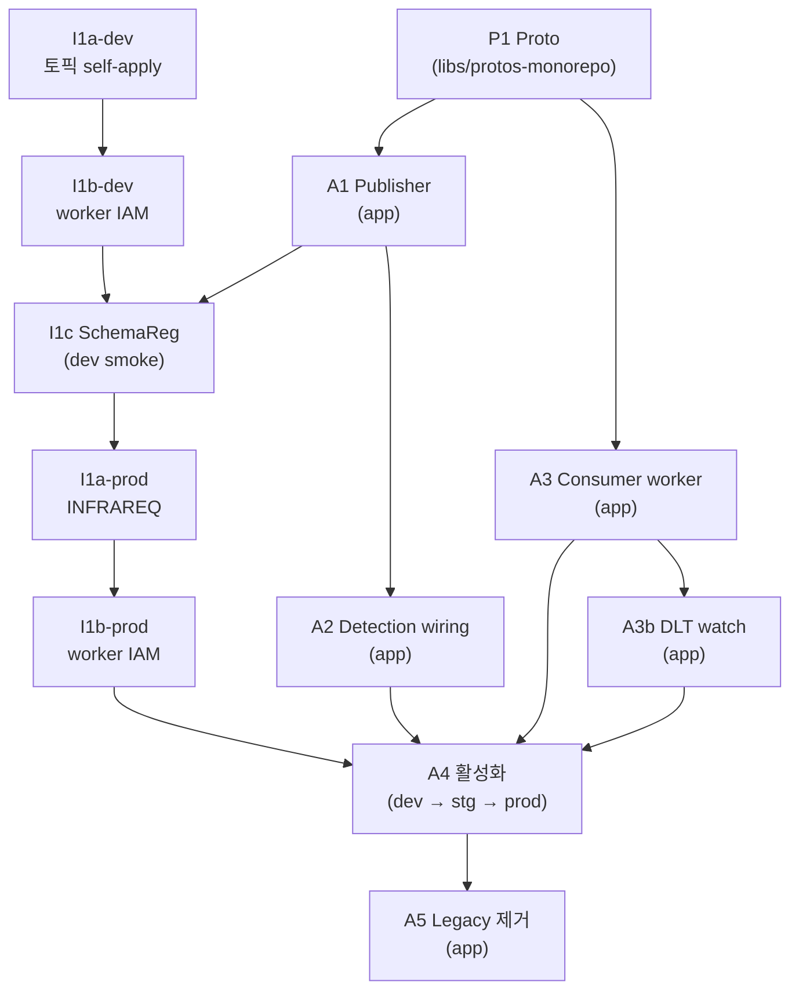

# NEWCS-3526 — 예약 이상 탐지 v1 · 구현 계획

> 전제 문서: `./spec.md` (정책), `./design.md` (구조), `./research.md` (맥락).
>
> 본 계획은 스펙·설계를 **land 가능한 청크** 로 쪼갠다. 각 청크는 **목표·제약·완료 기준** 만 정의하고, *어떻게* 는 청크 진입 시점에 현재 코드 상태를 다시 읽고 재도출한다. 본 문서 자체를 스크립트처럼 따르지 않는다.

---

## 1. 전역 제약 (모든 청크 공통)

- **Mission fail-safe**: 탐지 지점은 호출자에게 예외를 전파하지 않고 성공으로 귀결된다. 내부 이상은 흡수 + publish.
- **Publisher**: 호출자에게 throw 를 전파하지 않는다 (내부 `runCatching` 으로 sync-throw 차단, async 실패는 `whenComplete` callback). Publish 실패는 error log + Slack 알림으로 반드시 surface.
- **재판정 우선**: 소비자 판정은 이벤트 payload 가 아닌 **현재 DB 상태** 재조회 기반.
- **기존 로직 재사용**: 검증·판별 로직을 새로 짓지 않는다. 접근성 부족이면 visibility 조정 또는 최소 extract 만.
- **Consumer 재시도 정책**: 자동 재시도 없음. `@RetryableTopic(attempts = "1")` 로 DLT 라우팅만 설정 (기존 `HandleReservationListener` 동일 convention). **Retry 토픽은 만들지 않는다**. 근거는 `design.md` §7.6.
- **Schema Registry 전제**: proto 바이너리 serde 는 AWS Glue Schema Registry 의존 (기존 `dev-msk-schema-registry` / `prod-msk-schema-registry`). 기존 `CarOccupationProducerConfiguration` / `InboundAdapterKafkaConsumerConfiguration` 과 동일 클러스터·환경변수 재사용 — 신규 인스턴스 셋업 없음. Subject 는 `RecordNameStrategy` 에 따라 proto FQN (`socar.carsharing.reservation.event.v1.ReservationAnomalyDetected`) 으로 결정, `auto.register.schemas=true` 전제.
- **청크 크기**: Acceptance criteria 한두 항목을 증명할 수 있는 크기. 여러 관심사를 한 PR 에 섞지 않는다.
- **CI 규칙** (`CLAUDE.md`): 커밋 전 `./gradlew ktlintFormat` + `./gradlew build`. CI 실패 즉시 로컬 재현·수정.
- **PR 체인**: 의존이 있는 PR 은 이전 PR 브랜치를 base 로 스택.
- **언어**: PR 설명·Jira·Slack 은 한국어. 코드 주석·커밋 메시지는 영어 가능.

---

## 2. 작업 레포 & 인프라 경로

작업은 **3 개 영역** 에 걸쳐 일어난다 (carsharing-backend 모노레포 기준, 서브모듈 단위).

| 영역 | 경로 | 담당 작업 |
|---|---|---|
| **protos-monorepo** | `libs/protos-monorepo` | proto 스키마 추가 |
| **carsharing-reservation (app)** | `services/carsharing-reservation/subprojects/` | Publisher, 탐지 지점 wiring, consumer, legacy 제거 |
| **carsharing-reservation (infra)** | `services/carsharing-reservation/deploy/terraform/` | worker IAM (MSK 토픽 접근 권한) |
| **MSK 토픽 프로비저닝** | dev: 본인 self-apply / prod: `INFRAREQ` Jira | 환경별 경로 다름 |

> app / infra 는 **같은 git 서브모듈** 이지만 디렉토리·리뷰어가 달라 PR 분리 가능. MSK 토픽 자체는 우리 repo 밖에서 관리되지만, **dev 는 self-service** 로 직접 생성하고 **prod 만 INFRAREQ** 로 플랫폼 팀에 요청 — dev 에서 충분히 검증한 뒤 prod 티켓을 발행해 왕복 비용을 줄인다.

### 인프라 작업 규칙

- **MSK 토픽 dev**: 본인 self-apply (kafka-ui console 또는 사내 self-service 스크립트). 빠른 iteration.
- **MSK 토픽 prod**: **dev smoke 검증 후** `INFRAREQ` Jira 발행. 티켓 본문은 `design.md` §3.3 + §3.4 표의 값 나열.
- **IAM (`msk_data_access_resources`)**: 우리 repo terraform — dev PR + prod PR 로 직접 apply.
- staging 은 각 팀 관행에 맞춤 (보통 dev 와 동일 경로).

---

## 3. 의존 DAG

### 3.1 노드 요약

| 노드 | 영역 | 요약 |
|---|---|---|
| **P1** | `libs/protos-monorepo` | Proto 메시지 추가 |
| **I1a** | dev: self-apply / prod: `INFRAREQ` | Kafka 원본·DLT 토픽 프로비저닝 (dev 검증 후 prod 발행) |
| **I1b** | `services/carsharing-reservation/deploy/terraform` | worker IAM 에 토픽 3 ARN 추가 |
| **I1c** | 운영 확인만 | Schema Registry subject 자동 등록 검증 |
| **A1** | `services/carsharing-reservation` (app) | Publisher (direct Kafka + Slack fallback) |
| **A2** | `services/carsharing-reservation` (app) | 탐지 지점 wiring |
| **A3** | `services/carsharing-reservation` (app) | Consumer worker |
| **A3b** | `services/carsharing-reservation` (app) | DLT 모니터링 listener |
| **A4** | `services/carsharing-reservation` (app/config) | 활성화 (dev→stg→prod) |
| **A5** | `services/carsharing-reservation` (app) | Legacy 제거 |

### 3.2 ASCII DAG

```
 Layer 0 (독립 시작점)
 ┌───────────┐          ┌──────────────────────────┐
 │    P1     │          │       I1a-dev            │
 │   Proto   │          │  토픽 self-apply (dev)   │
 │ (protos)  │          └────────────┬─────────────┘
 └─────┬─────┘                       │
       │                             ▼
       │                  ┌──────────────────┐
       │                  │     I1b-dev      │
       │                  │  worker IAM (dev) │
       │                  └────────┬─────────┘
       │                           │
       ├──────────────────┐        │
       ▼                  ▼        │
 ┌───────────┐      ┌───────────┐  │
 │    A1     │      │    A3     │  │
 │ Publisher │      │  Consumer │  │
 └─────┬─────┘      └─────┬─────┘  │
       │                  │        │
       ▼                  ▼        │
 ┌───────────┐      ┌───────────┐  │
 │    A2     │      │   A3b     │  │
 │ Detection │      │ DLT watch │  │
 └─────┬─────┘      └─────┬─────┘  │
       │                  │        │
       └────┬─────────────┘        │
            │                      │
            ▼                      │
     ┌──────────────────┐          │
     │       I1c        │◀─────────┘
     │ SchemaReg 확인   │   (dev smoke 후)
     │  (A1 publish 이후)│
     └────────┬─────────┘
              │
              ▼
     ┌──────────────────────────┐
     │       I1a-prod           │
     │  토픽 INFRAREQ 발행      │
     │  (dev 검증 완료 후)       │
     └────────────┬─────────────┘
                  ▼
     ┌──────────────────┐
     │     I1b-prod     │
     │  worker IAM(prod) │
     └────────┬─────────┘
              ▼
     ┌──────────────────────────────┐
     │            A4                │
     │  활성화: dev → stg → prod     │
     └──────────────┬───────────────┘
                    ▼
            ┌───────────────┐
            │      A5       │
            │  Legacy 제거  │
            └───────────────┘
```

### 3.3 Mermaid (렌더 뷰어용)



### 3.4 엣지 근거 (왜 이 의존이 필요한가)

| From → To | 근거 |
|---|---|
| P1 → A1 | Publisher 가 `ReservationAnomalyDetected` proto 타입을 사용 (compile) |
| P1 → A3 | Consumer 가 proto 역직렬화 (compile) |
| A1 → A2 | 탐지 지점이 Publisher bean 을 주입 (compile) |
| A2 → A4 | 탐지 지점에서 실제 이벤트가 나와야 활성화 검증 가능 |
| A3 → A4 | Consumer 가 돌아야 활성화 검증 가능 |
| A3 → A3b | DLT watch 는 동일 worker 에 얹고 설정·DLT 경로 재사용 |
| A3b → A4 | prod 가동 시점부터 DLT 모니터링이 있어야 유실이 가시화됨 |
| I1a-dev → I1b-dev | 권한 대상 토픽이 존재해야 IAM 이 의미 있음 |
| I1b-dev → I1c | dev smoke 는 IAM 이 열려야 가능 |
| A1 → I1c | Schema Registry 자동 등록 검증은 Publisher 가 첫 메시지를 쏘아야 가능 |
| I1c → I1a-prod | prod INFRAREQ 는 dev 검증 완료 후 발행 (왕복 비용 최소화) |
| I1a-prod → I1b-prod | prod 권한도 대상 존재 이후에 apply |
| I1b-prod → A4 | prod IAM 없이는 prod worker 가 send/consume 불가 |
| A4 → A5 | Legacy 제거는 신규 경로가 prod 에서 검증된 뒤 |

### 3.5 병렬 기회

- **P1 / I1a-dev** 는 서로 독립 루트 — 담당자가 다르면 동시 착수 가능. 특히 I1a-dev 는 self-apply 라 승인 대기 없음.
- **A1 ↔ A3** 는 P1 만 있으면 각각 독립적으로 코드 작성·단위 테스트 진행 가능 (A3 는 A2 에 compile 의존하지 않음).
- **I1a-prod (INFRAREQ) 발행 시점**: dev smoke 검증 이후로 지연 — 섣부른 발행은 설정값 수정 시 이중 왕복 비용.
- 코드·단위 테스트는 I1a 승인 여부와 무관하게 계속 진행.

---

## 4. 청크

각 청크는 **repo · goal · 제약 · 완료 기준 · 의존** 포맷. "한 PR" 을 가정하되 작업량에 따라 쪼개도 좋다.

### P1 — Proto 스키마 추가
- **Repo**: `libs/protos-monorepo`
- **목표**: `ReservationAnomalyDetected` 추가 + codegen 가능.
- **제약**:
  - 위치·패키지·필드는 `design.md` §4.
  - 기존 `carsharing-reservation-event/v1` 네임스페이스 내부 신규 파일. 기존 메시지 field index 불변.
- **완료 기준**: proto 모노레포 빌드 green + 소비 서비스 codegen 결과에 메시지 포함.
- **의존**: 없음.

### I1a — Kafka 토픽 프로비저닝 (dev self-apply → prod INFRAREQ)

환경별로 경로가 다르다. **물리 설정 값은 `design.md` §3.3 (원본) · §3.4 (DLT) 표에서 복사** — 본 청크는 *어떻게 적용할지* 만 담당.

- **Repo**: 없음 (운영 작업).
- **목표**: `carsharing.reservation.anomaly` + `carsharing.reservation.anomaly.dlt` 두 토픽을 dev → prod 순서로 프로비저닝.
- **제약**:
  - **I1a-dev — self-apply**: dev 환경은 본인이 직접 생성. 경로는 팀 관행 (kafka-ui console 또는 사내 self-service 스크립트). INFRAREQ 경유하지 않음. 빠른 iteration 이 목적.
  - **I1a-prod — INFRAREQ**: prod 환경은 `INFRAREQ` Jira 로 플랫폼 팀에 요청. 본문은 `design.md` §3.3 + §3.4 표의 값을 나열. 선례 형식 참고: `INFRAREQ-3870` (원본 topic 생성), `INFRAREQ-2849` (DLT 설정 예).
  - **순서 제약**: dev 생성 → A1~A3 dev smoke 검증 → I1c 통과 → prod INFRAREQ 발행. prod 티켓을 dev 검증 전에 발행하면 설정값 수정 시 이중 왕복 비용.
  - Retry 토픽은 요청 목록에 포함하지 않는다 (`design.md` §3.1 단서 참고 — `attempts = "1"`).
- **완료 기준**: dev/prod 양쪽에서 두 토픽이 kafka-ui 로 조회 가능 + DLT redrive 수동 절차 운영자 가이드 공유.
- **의존**: 없음 (P1 과 병렬 시작 가능). 단, prod 단계는 dev smoke 완료에 blocked-by.

### I1b — 서비스 IAM 권한 추가 (worker)
- **Repo**: `services/carsharing-reservation/deploy/terraform/{dev,prod}.ap-northeast-2/carsharing_reservation_worker/app.tf`
- **목표**: worker 서비스 계정에 신규 토픽 2 종(원본·DLT) read/write 권한 부여.
- **제약**:
  - 추가할 ARN 2 줄은 `design.md` §3.6 참고 (retry wildcard 없음 — 재시도 없는 정책).
  - dev PR 과 prod PR 은 **각각 apply** — 환경별로 I1a 해당 환경이 끝난 뒤.
  - 본인이 직접 apply (INFRAREQ 무관 — 우리 repo 내 terraform 이므로).
  - Schema Registry IAM 변경은 불필요 — 기존 `kafka_schema_registry_arn` 모듈 설정 재사용.
- **완료 기준**: 각 환경 worker pod 가 smoke 로 토픽에 publish/consume 성공.
- **의존**: I1a 해당 환경 완료.

### I1c — Schema Registry subject 확인
- **Repo**: 없음 (운영 확인만).
- **목표**: `auto.register.schemas=true` 로 Publisher 첫 publish 시 subject (`socar.carsharing.reservation.event.v1.ReservationAnomalyDetected`) 가 자동 등록됨을 dev 에서 확인.
- **제약**: 자동 등록이 실패하거나 policy 상 차단되는 환경이면 Schema Registry 전용 INFRAREQ 발행. 현재 publisher 들(`CarOccupationIntegrationEventKafkaPublisher` 등) 과 동일 동작 기대.
- **완료 기준**: dev smoke publish 후 Glue Schema Registry 콘솔에 subject 노출.
- **의존**: I1b + A1.

### A1 — Publisher 구현
- **Repo**: `services/carsharing-reservation` (app)
- **목표**: `ReservationAnomalyPublisher` 인터페이스 + `KafkaReservationAnomalyPublisher` 구현. 호출처 없음.
- **제약**:
  - 도메인 인터페이스는 `reservation.core` 에, 구현은 `outbound/kafka` 에. Plain non-suspend.
  - `KafkaTemplate<String, ReservationAnomalyDetected>` 주입, `send(...).whenComplete { _, ex -> ... }` 패턴 (기존 `CarOccupationIntegrationEventKafkaPublisher` 와 동일 idiom).
  - 전송 실패 시 error log + `SocarMessageClient.sendAnomalyPublishFailureMessage(...)`. Slack 자체 실패는 2차 error log.
  - Publisher 메서드는 호출자에게 throw 하지 않는다 (outer `runCatching` 으로 sync-throw 도 흡수).
  - Proto binary serde 는 기존 `CarOccupationProducerConfiguration` / `CarOccupationKafkaTemplatesConfiguration` 패턴 mirror (Confluent Schema Registry + `KafkaProtobufSerializer`).
- **완료 기준**:
  - 단위 테스트: 성공 경로 / send 비동기 실패 시 Slack 호출 / Slack 실패 시 fallback log / `send()` sync throw 시 Slack 호출 / publisher 가 호출자에게 throw 하지 않음.
  - 서비스 부팅 OK.
- **의존**: P1 merged + proto 서브모듈 포인터 sync.

### A2 — 탐지 지점 wiring
- **Repo**: `services/carsharing-reservation` (app)
- **목표**: `design.md` §6 의 두 지점에서 mission 을 fail-safe 화하고 `publisher.publish(...)` 호출.
- **제약**:
  - 변경 범위는 해당 두 지점에 한정. diff 에 스코프 외 변경 없음.
  - mission 은 예외를 호출자에게 전파하지 않도록 swallow — 기존 FailureNotifier 호출부 치환 포함.
  - 동일 invocation 내 같은 `Site` 로 중복 publish 금지.
- **완료 기준**: 두 지점의 test 가 (a) mission 성공 귀결 (b) publisher 호출 여부 (c) publisher throw 해도 mission 성공 을 검증.
- **의존**: A1.

### A3 — Consumer (worker)
- **Repo**: `services/carsharing-reservation` (app)
- **목표**: `ReservationAnomalyKafkaListener` + `classify` + `probeWithRetry` + `CarTakeoverRequestHandler` + DLT 모니터링 listener → end-to-end 가능.
- **제약**:
  - 호스팅은 `bootstrap/worker` (기존 `reservation.inbound.kafka-consumer` + Spring Kafka 설정 재사용). 모듈 신설 금지.
  - **Retry/DLT**: `@RetryableTopic(attempts = "1")` — 자동 재시도 없음, 예외 발생 시 즉시 DLT. Retry 토픽 미생성. 근거는 `design.md` §7.6.
  - Classifier 는 기존 repository·service (`findByCarIdsAndOccupationInterval`, `CarOccupationService.findOne`, benign helper) 만 사용.
  - benign helper 재사용 형태는 진입 시점 코드 보고 결정 (최소 public 화 선호).
  - `IdleZeroService.isIdleZeroTarget` → `public`.
  - `probeWithRetry` 재시도 조건은 `isIdleZeroApplied && now < confirmDeadline`.
  - `probeWithRetry` 는 **`common/lib` 의 retry util 에 맞춤**. 기존 `retryWhen` / `retryOn` 은 예외 기반이라 값 기반 폴링에 부적합 → `Retry.kt` 에 **값 기반 sibling `retryUntil`** 추가 (strictly additive, 기존 caller 영향 없음). 상세 시그니처·근거 `design.md` §7.4. 이 util 확장은 A3 PR 에 함께 포함 (스코프가 매우 작아 분리 비용이 이득 초과).
  - Handler 는 기존 `createForceExtendConflictJiraIssueIfApplicable` 로직 이식 + **Jira 티켓 본문 확장** (운영팀 합의: 점유 차량 번호 + 현재 충돌 중인 예약 목록 **복수**). 신규 검증 로직은 금지하되, 본문 렌더링/DTO 확장은 허용. 상세 §7.5 design.md.
  - Handler 입력은 classifier 가 이미 계산한 `overlaps - benignOverlaps` 목록을 그대로 수신 — 별도 조회 중복 금지.
  - listener 는 enable 토글을 가진다.
- **완료 기준**:
  - Classify 두 검사 단위 테스트.
  - probe-with-retry 타이밍·대상 필터 단위 테스트.
  - listener ↔ classify ↔ handler happy-path 통합 테스트 (testcontainers 또는 dev).
  - handler 실패 Slack fallback 동작 테스트.
- **의존**: P1. end-to-end 검증은 I1+A1+A2 모두 완료된 환경에서.

### A3b — DLT 모니터링 listener
- **Repo**: `services/carsharing-reservation` (app)
- **목표**: `ReservationAnomalyDltListener` — DLT 토픽 소비 → `SocarMessageClient` 로 운영 Slack 알림.
- **제약**:
  - 기존 `HandleReservationDltListener` 와 동일 idiom (자체 `@KafkaListener` 또는 `@RetryableTopic` 의 DLT handler 엔트리).
  - 메시지 파싱은 best-effort: payload 복호 실패해도 topic/offset/key 만으로 Slack 알림 가능해야 한다 — DLT 에 들어온 것 자체가 상위 처리 실패 신호이므로 `reservation_id` 파싱에 의존해선 안 된다.
  - **자동 redrive 금지** (v1). 수동 대응을 전제로 한 가시화만 담당.
  - 알림 중복을 줄이기 위해 handler 내부 짧은 TTL dedup (메시지 키 기준) 를 두어도 된다 — 필수 아님.
- **완료 기준**:
  - DLT 토픽에 임의 메시지 투입 시 Slack 알림 1건 발생을 dev 환경에서 확인.
  - payload decode 실패 시에도 알림이 발생함을 단위 테스트로 증명.
- **의존**: A3. I1 에서 DLT 토픽이 이미 확보된 상태 전제.

### A4 — 단계적 활성화
- **Repo**: `services/carsharing-reservation` (app, config 위주)
- **목표**: publisher / consumer 를 dev → staging → prod 순차 활성화.
- **제약**:
  - canary 구간 없음. 각 환경에서 **실제 이상 이벤트 1건** end-to-end 확인 후 다음 환경.
  - Legacy 경로는 **A5 전까지 유지** — 동일 이상이 새/구 경로 양쪽에 알림될 수 있음(예상됨).
- **완료 기준**: prod 에서 `ReservationAnomalyDetected` 1건이 Resolved 또는 Jira 티켓으로 귀결됨을 로그·Jira 에서 확인.
- **의존**: P1, I1, A1, A2, A3 **모두 prod 반영** 완료.

### A5 — Legacy 제거
- **Repo**: `services/carsharing-reservation` (app)
- **목표**: deprecation 대상 삭제.
- **제약**:
  - 삭제: `FailureNotifier` + `notifyOccupationToReservationReconciliationFailure` 호출부, `createForceExtendConflictJiraIssueIfApplicable` + `sendForceExtendJiraFailureMessage` 본문·호출.
  - `resolveIfPossible` auto-resolve 분기는 건드리지 않음.
  - 관련 테스트·mock·주석 정리 포함.
- **완료 기준**: 삭제 PR merge 후 회귀 green + 실제 이상 발생 시 새 경로로만 산출물 생성 확인(prod 1건 이상) + 생성된 Jira 티켓 본문에 (a) 차량 번호 (b) 복수 충돌 예약 목록 이 담긴 것을 수기 확인.
- **의존**: A4 prod 활성 + 등가성 확인.

---

## 5. 검증 전략

- **단위 테스트**: 각 청크가 해당 청크의 완료 기준을 만족하는 테스트를 포함한다. Publisher throw 금지 + 실패 surface, Classifier 판정, probe-with-retry 타이밍·대상 필터가 주요 대상.
- **통합 테스트**: listener 레벨은 testcontainers 또는 `spring-kafka-test` 로. Publisher 실제 Kafka 전송은 dev 환경 스모크로 갈음.
- **Acceptance criteria 매핑**: spec.md 의 각 AC 항목이 어느 청크에서 증명되는지를 PR 설명에 명시.

---

## 6. 롤백 전략

- 각 청크는 독립 revert 가능하도록 PR 분리.
- A2 (탐지 wiring) revert 시 legacy 경로는 그대로 동작 (A5 이전이면). A5 이후 revert 는 legacy 복원 PR 을 함께.
- Publisher/Consumer 활성화는 설정 토글로 즉시 on/off 가능해야 한다 (A1/A3 에서 보장).
- 인프라 롤백: terraform revert + apply. prod 롤백이 필요하면 `INFRAREQ` 재발행.

---

## 7. 중단·재검토 지점

아래 상황이면 진행 멈추고 상위 문서(spec/design) 재검토 + 사용자 확인.

- A2 진입 시 탐지 지점 주변 코드가 `design.md` 기술 시점 대비 유의미하게 바뀐 경우 (line 위치, catch 블록 구조 등).
- A3 에서 benign helper 재사용이 "최소 public 화" 범위를 넘어 의미 있는 refactor 를 요구할 때.
- 인프라(prod) 승인 지연으로 A4 진입 불가 시 — 사용자 타임라인 재합의.
- A4 prod 활성 후 Jira/Slack 산출물이 기존과 달라지면 A5 진입 금지 + handler 조정.

---

## 8. 외부 조율

- **플랫폼 팀** (Kafka/MSK): I1a 를 `INFRAREQ` Jira 로 발행 — dev + prod 각각. 선례 참고: `INFRAREQ-3870` (원본), `INFRAREQ-2849` (DLT).
- **운영자**: DLT redrive 수동 절차 + Publisher 실패 Slack 알림 채널 가이드 공유 (I1a/I1b 완료 시점).

---

## 9. 리뷰·합의 반영 요약

이전 이터레이션의 PR 체인(P1/I1/A1/A2) 은 **리뷰 후 모두 폐기 후 재시작**. 아래는 이번 계획에 반영된 리뷰/합의 항목:

| # | 출처 | 반영 대상 | 요약 |
|---|---|---|---|
| 1 | PR #59 review #1 | design.md §3, §7.6 · plan.md §1, I1a, A3, A3b | Consumer 는 `@RetryableTopic(attempts = "1")` 로 **재시도 없이** DLT 직행. DLT 는 `ReservationAnomalyDltListener` 가 Slack 운영 알림으로 surface. 유실 조용히 허용 금지. |
| 2 | PR #59 review #2 | design.md §3 · plan.md §1, I1 | Kafka value protobuf 는 Confluent Schema Registry 필수. 기존 publisher 와 동일 환경 재사용. Subject = proto FQN (`RecordNameStrategy`). |
| 3 | PR #59 review #3 | design.md §4.2 | `ReservationAnomalyDetected` 스키마에서 `detected_time` 삭제 (Kafka record timestamp 로 대체). `Site` 는 유지 (DLT/Jira 추적 가치). |
| 4 | Slack 합의 (2026-04-16, 앤디) | spec.md invariant #6, AC · design.md §7.5 · plan.md A3, A5 | 대차 요청 Jira 티켓 본문에 (a) 점유 확정 차량 번호 + (b) 같은 차량·구간에 충돌 중인 예약 **복수** 를 반드시 포함. CS 센터가 티켓을 직접 참조해 조기 대응. Legacy 는 단일 id 만 포함하므로 handler 단에서 확장 필수. |
