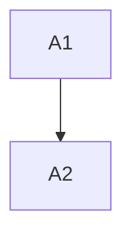

# LP-1 - TASK

## Guidelines
- Keep anomaly reporting additive until production verification completes.

## Dependency DAG

## Task: A1

**Goal**: Add anomaly publisher per `SPEC#O-1-anomaly-visible`, realized by `DESIGN#Decision-1-async-publisher`.

**Repo**: `services/reservation`

**Completion criteria**:
- Publisher emits anomaly for `SPEC#O-1-anomaly-visible`.

**Dependencies**: none

## Task: A2

**Goal**: Wire detection point using the publisher from `DESIGN#Decision-1-async-publisher`.

**Repo**: `services/reservation`

**Completion criteria**:
- Detection path emits anomaly for `SPEC#O-1-anomaly-visible`.

**Dependencies**: A1

## Forward coverage

| SPEC item | Realized by |
|---|---|
| O-1 anomaly-visible | A1 + A2 Completion criteria |
| INV-1 mission-fail-safe | **GAP** — non-blocking property is enforced upstream by the existing reservation framework's call-path; no task in this feature instruments it. Acceptance approved by ops on 2026-04-25. |
