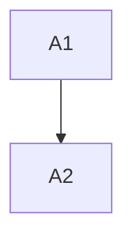

# LP-1 - TASK

## Guidelines
- Keep anomaly reporting additive until production verification completes.

## Dependency DAG

## Task: A1

**Goal**: Add anomaly publisher per `SPEC#O-1-anomaly-visible`, realized by `DESIGN#Decision-1-async-publisher`.

**Repo**: `services/reservation`

**Completion criteria**:
- Publisher emits anomaly for `SPEC#O-1-anomaly-visible`.
- Publisher failure does not fail mission path per `SPEC#INV-1-mission-fail-safe`.

**Dependencies**: none

## Task: A2

**Goal**: Wire detection point using the publisher from `DESIGN#Decision-1-async-publisher`.

**Repo**: `services/reservation`

**Completion criteria**:
- Detection path emits anomaly for `SPEC#O-1-anomaly-visible`.

**Dependencies**: A1
